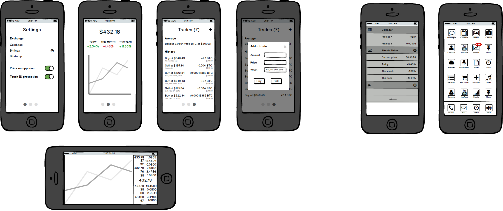

# Bitcoin Ticker

## Sprint 1 - Demo

## Sprint 2 - Demo

## Mocks

## TODO

Price on main screen
- [x] Real time bitcoin price on main page
- [ ] Show last time the price was updated
- [x] Last price in local storage

Price on app icon
- [x] Display the current price on the app icon using push notifications
- [x] Add a setting in the app to enable to disable the feature

Price in widget view
- [ ] Display bitcoin price info in the widget view

Trades view
- [x] Add a basic view to add and list the user trades
- [ ] Add a basic view to remove trades
- [ ] Add a basic view to update trades
- [ ] Add touchId protection for the trade view
- [ ] Add average buy/sell price

UI and polish
- [x] Create an icon
- [ ] Create a launch screen
- [x] Organize view in a scrollview (Settings - Main - Trades)
- [ ] Update colors and fonts

CI
- [x] Use a deployment tool (Crashlytics)
- [x] Add a crash reports (Crashlytics)
- Analytics?
